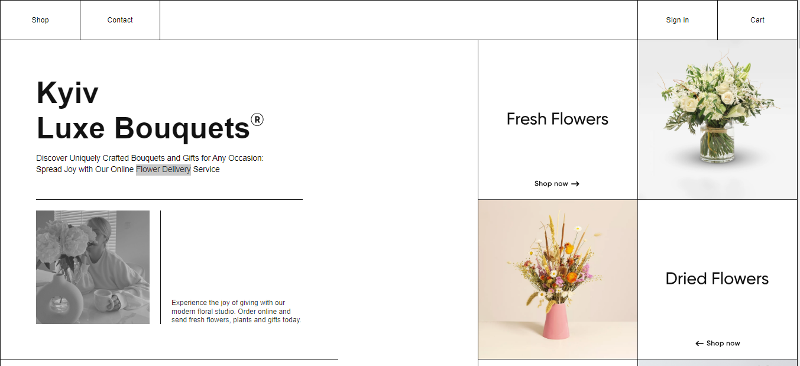

<h1 align="center">Flower Delivery Website</h1>

  

## Live Demo

You can access a live demo of the Flower Delivery Website [here](https://your-username.github.io/flower-delivery-website).

## Pages

The Flower Delivery Website consists of the following pages:

- **Home**: Displays featured flower arrangements and promotions.
- **Shop**: Allows users to browse a wide selection of flowers and floral arrangements.
- **Search**: Provides a search functionality to find specific flowers or arrangements.
- **Cart**: Enables users to add selected items to the shopping cart and place orders.
- **Authentication**: Allows user authentication and account creation for personalized experiences.
- **Checkout**: Provides delivery options and address selection during the checkout process.
- **Payment**: Integrates with a secure payment system for online transactions.
- **Order Tracking**: Enables users to track their orders and view order history.
- **Contact**: Includes a contact form for inquiries or customer support.

## Features

The Flower Delivery Website offers the following features:

- Browse a wide selection of flowers and floral arrangements.
- Search functionality to find specific flowers or arrangements.
- Shopping cart to add selected items and place orders.
- User authentication and account creation for personalized experiences.
- Delivery options and address selection during checkout.
- Payment integration for secure online transactions.
- Order tracking and order history for easy reference.
- Contact form for inquiries or customer support.

## Getting Started

To run the project locally, follow these steps:

1. Clone the repository:
2. git clone https://github.com/your-username/flower-delivery-website.git

2. Open the project directory in your preferred code editor.

3. Launch the website by opening the `index.html` file in a web browser.

## Figma Design

The design for the Flower Delivery Website UI and UX can be viewed on Figma. You can access it [here](https://www.figma.com/file/C7CU2GJPwMxvOxnaYYxdBl/eCommerce-Flower-Delivery-website-UI-and-UX-Ui-kit-Template-Community?type=design&is-community-duplicate=1&fuid=).

Feel free to explore the design and use it as a reference for your project.

## Customization

If you wish to customize the Flower Delivery Website, you can modify the HTML, CSS, and JavaScript files in the project. Feel free to update the content, styles, or add additional features as needed.

## Contributing

Contributions are welcome! If you find any issues or have suggestions for improvements, please open an issue or submit a pull request.

## License

This project is licensed under the [MIT License](LICENSE).

## Credits

The Flower Delivery Website was created by [Your Name](https://github.com/your-username). We would like to express our appreciation to the contributors and the open-source community for their valuable contributions.

If you have any further questions or need assistance, please feel free to reach out. Enjoy exploring the Flower Delivery Website!
